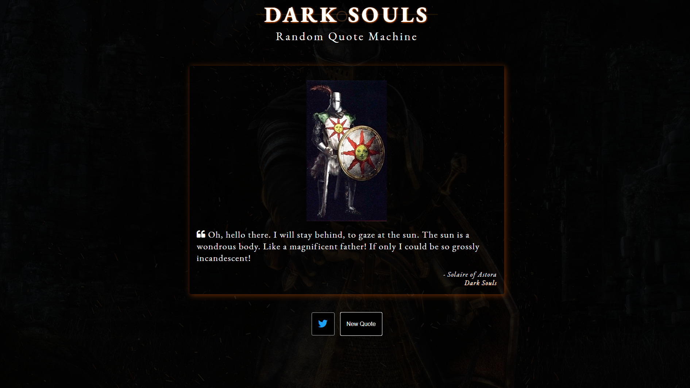

# fcc-Front End Libraries Certification Projects
5 projects for the front end libraries certication with fcc 300hrs

Any mix of HTML, JavaScript, CSS, Bootstrap, SASS, React, Redux, and jQuery to complete these projects.  It is encouraged to utilize a frontend framework as the FreeCodeCamp section is about learning frontend frameworks.

## Random Quote Machine:

For this project I used quotes from one of my favourite games Dark Souls.

Coded with:
* HTML
* CSS
* jQuery

To submit a project to FreeCodeCamp it is required to use CodePen, this gave me a few CORS Origin issues when trying to get JSON data from GitHub.  After trying to work around this, it was easiest to make a gist which gave me no issues.  The Fisher–Yates shuffle algorithm was utilized for generating a random permutation of my quotes.

Resources:

[Fisher Yates Shuffle Algorithm](https://en.wikipedia.org/wiki/Fisher%E2%80%93Yates_shuffle)

[Stack overflow link](http://stackoverflow.com/a/2450976)

[For Images and Quotes](https://darksouls.wiki.fextralife.com)

[For Images and Quotes](https://darksouls.fandom.com/wiki)

### Screenshot:

[Quick View on Codepen](https://codepen.io/FoxyStoat/full/WNGbjea)

I'm still adding more quotes to the JSON data and images, although images are not required to pass the FreeCodeCamp tests.

If your a Dark Souls fan and wish to use the quotes then please feel free to use my [JSON data](https://github.com/FoxyStoat/fcc-front-end-libraries-certification/blob/main/Dark%20Souls%20random%20quote%20machine/assets/data.json) or [gist](https://gist.githubusercontent.com/FoxyStoat/4cb3bb827521c1a8640392db67612f3e/raw/00f2dcce2d32b6f39621ab8d481828fdc9038388/darksouls-quotes.json) for your own project.

